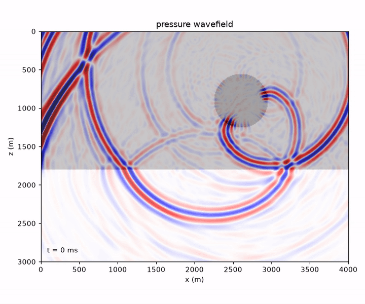
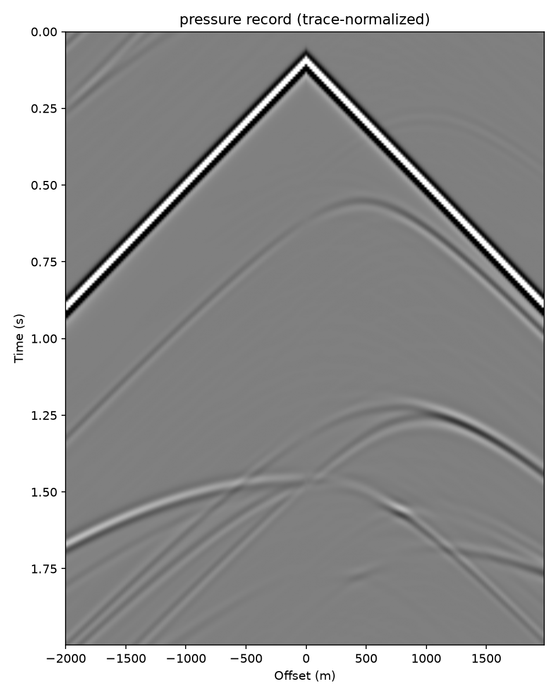

# bornwave

**GPU acoustic wave simulation without time stepping** — a matrix-free
Convergent Born Series (CBS) solver for the acoustic Helmholtz equation with
**arbitrary heterogeneous sound speed, density and attenuation**, written in
PyTorch. One call gives you shot records, full wavefield movies, and (via the
adjoint-state autograd) FWI gradients.

<!--
Showcase assets: run `python examples/demo_engine.py`, then

    mkdir -p docs
    cp examples/demo_shot_p.png docs/
    ffmpeg -i examples/demo_wavefield.mp4 \
      -vf "fps=12,scale=720:-1:flags=lanczos,split[s0][s1];[s0]palettegen[p];[s1][p]paletteuse" \
      -loop 0 docs/demo_wavefield.gif

For a playable MP4 with sound controls, open this file in GitHub's web
editor and drag examples/demo_wavefield.mp4 straight into it — GitHub
hosts the video and inserts an embedded player.
-->

<p align="center">
  
</p>
<p align="center">
  
  <br/>
  <em>Two-layer model with a low-velocity lens: pressure wavefield movie and shot record,
  produced by <code>examples/demo_engine.py</code> in one call.</em>
</p>

```python
import numpy as np
from bornwave import acoustic2d, trace_norm, plot_shot, plot_wavefield_video

nz, nx = 300, 400                        # arrays are (nz, nx): vp[z, x]
dh, dt, nt, f0 = 10.0, 1e-3, 2000, 15.0
vp  = np.full((nz, nx), 2500.0); vp[180:]  = 3200.0
rho = np.full((nz, nx), 2000.0); rho[180:] = 2300.0

res = acoustic2d(vp, rho, dh, dt, nt, f0,
                 sx=[nx // 2], sz=[10],            # multi-shot: pass lists,
                 rx=np.arange(0, nx, 2), rz=10,    # solved as one batch
                 nbc=60, snap_interval=25)

res.seis_p, res.seis_vx, res.seis_vz     # (nt, nrec) time-domain records
res.snaps                                 # (nsnap, nz, nx) wavefield movie
res.H_p                                   # unit-source transfer functions:
res.resynthesize(other_wavelet)           #   swap wavelets at zero cost
res.stats.kernel_time_s                   # timing / iteration diagnostics

plot_shot(trace_norm(res.seis_p), "shot.png", dt=dt)
plot_wavefield_video(res.snaps, "wavefield.mp4", fps=12, dh=dh,
                     snap_times=res.snap_times, adaptive_clims=True, model=vp)
```

## Theory

This repository is an independent PyTorch implementation of the algorithm of
**Stanziola, Arridge, Treeby & Cox (2025)**: the universal split
preconditioner of **Vettenburg & Vellekoop (2022)** applied to the
first-order acoustic system `[u_x, u_z, p]` on a staggered Fourier grid,
which extends the original convergent Born series of **Osnabrugge,
Leedumrongwatthanakun & Vellekoop (2016)** to heterogeneous sound speed
**and density** with absorption. All algorithmic credit belongs to those
papers; implementation choices, the engine layer, and any bugs are ours.

- A. Stanziola, S. R. Arridge, B. T. Treeby, B. T. Cox,
  *Iterative Born solver for the acoustic Helmholtz equation with
  heterogeneous sound speed and density*,
  [arXiv:2507.16087](https://arxiv.org/abs/2507.16087) (2025).
- T. Vettenburg, I. M. Vellekoop,
  *A universal matrix-free split preconditioner for the fixed-point
  iterative solution of non-symmetric linear systems*,
  [arXiv:2207.14222](https://arxiv.org/abs/2207.14222) (2022).
- G. Osnabrugge, S. Leedumrongwatthanakun, I. M. Vellekoop,
  *A convergent Born series for solving the inhomogeneous Helmholtz equation
  in arbitrarily large media*, J. Comput. Phys. **322** (2016) 113–124.

<details>
<summary>BibTeX</summary>

```bibtex
@misc{stanziola2025iterativeborn,
  title         = {Iterative Born solver for the acoustic Helmholtz equation
                   with heterogeneous sound speed and density},
  author        = {Stanziola, Antonio and Arridge, Simon R. and
                   Treeby, Bradley E. and Cox, Ben T.},
  year          = {2025},
  eprint        = {2507.16087},
  archivePrefix = {arXiv},
  primaryClass  = {physics.comp-ph}
}
@misc{vettenburg2022universal,
  title         = {A universal matrix-free split preconditioner for the
                   fixed-point iterative solution of non-symmetric linear systems},
  author        = {Vettenburg, Tom and Vellekoop, Ivo M.},
  year          = {2022},
  eprint        = {2207.14222},
  archivePrefix = {arXiv},
  primaryClass  = {math.NA}
}
@article{osnabrugge2016convergent,
  title   = {A convergent {Born} series for solving the inhomogeneous
             {Helmholtz} equation in arbitrarily large media},
  author  = {Osnabrugge, Gerwin and Leedumrongwatthanakun, Saroch and
             Vellekoop, Ivo M.},
  journal = {Journal of Computational Physics},
  volume  = {322},
  pages   = {113--124},
  year    = {2016}
}
```
</details>

Despite the name, this is a **full-wave** solver: "Born" refers to the form
of the iterative series, not to the first-order Born approximation. The
converged solution satisfies the heterogeneous Helmholtz system exactly (to
the true residual, which is verified with an independently assembled forward
operator, not the iteration's own increment), including all internal
multiples and diffractions.

## Highlights

- **Arbitrary heterogeneous models**: sound speed, density (linearly
  interpolated to the staggered half-grid, paper eq. 39), absorption in
  Np/m or constant-Q.
- **Spectral spatial accuracy** — no numerical dispersion; ~2–3 points per
  wavelength are meaningful, 10 ppw is luxurious.
- **Matrix-free, preconditioner-free iteration**: each step is pointwise
  multiply-adds → one batched FFT → an unrolled per-k 3×3 product → IFFT →
  pointwise multiply-adds. Built for GPUs.
- **Shots are nearly free**: all operator tensors are shared across a shot
  batch; the engine iterates `(F, B, 3, Nz, Nx)` — frequencies × shots
  jointly, with converged frequencies compacted out on the fly.
- **CUDA Graphs**: the fixed-point loop is captured and replayed as a single
  launch, removing per-kernel launch latency — the dominant cost at seismic
  grid sizes with thousands of iterations per frequency. Falls back to eager
  execution automatically; results are identical.
- **Exact wavefield movies without time stepping**: snapshots are
  band-limited inverse-FFT samples of the stored full-field transfer
  functions (equal to `np.fft.irfft` to machine precision,
  `tests/test_timesynth.py`) — the `(nt, nz, nx)` cube is never materialized.
- **Differentiable**: `solve_helmholtz` implements the adjoint-state
  gradient via the implicit function theorem — O(1) memory in the iteration
  count, exact (verified by `torch.autograd.gradcheck` and directional
  finite differences). See `examples/fwi_gradient.py` for a single-frequency
  FWI gradient that images a hidden interface.

## Install & run

Requires Python ≥ 3.10, PyTorch ≥ 2.4 (CUDA optional but strongly
recommended), numpy, scipy, matplotlib; ffmpeg for MP4 export.

```bash
uv sync                                   # or: pip install -e .
uv run tests/test_engine_api.py           # engine cross-validation (~1 min)
uv run examples/demo_engine.py            # records + wavefield movie
uv run examples/two_layer_ricker.py       # full physics validation suite
```

## Validation

Every layer is checked against something it did not produce itself —
operator identities, analytic Green's functions, plane-wave reflection
theory, and reciprocity:

| Test | Result |
|---|---|
| `(L+I)(L+I)^{-1} = I` per k-point | 9e-16 |
| Adjoint symbol identity; skew-Hermitian differential block | 1e-15 / 0 |
| Homogeneous medium vs analytic Hankel Green's function (10 ppw) | rel. L2 **8.9e-5**, amplitude ratio 1.0000, phase 0.00° |
| Strong-contrast disk (2× speed, 2.5× density): acoustic reciprocity | **3.2e-6** |
| Two-layer + 15 Hz Ricker gather, direct-wave window vs Hankel | mean 0.075%, max **0.18%** |
| Zero-offset reflection amplitude vs Zoeppritz R₀ = 0.5714 | **0.08%** |
| AVO curve (0–600 m offset) vs fluid–fluid Zoeppritz R(θ) | max 0.54% |
| Reflection moveout / inverted interface depth | ≤ 1.3 ms (< 1 sample) / 596.3 m vs 596.25 m |
| Engine (freq × shot batch) vs reference frequency-batch solver | 2.6e-7 |
| Batched shots vs sequential shots | 0.0 |
| Wavefield snapshots vs receiver records at shared samples | 3e-16 |
| Direct-wave lag between receivers vs offset / c | exact (50/50 samples) |
| Autograd: `gradcheck` + finite differences through (c₀, ρ₀, α, s) | pass |

Reproduce with the scripts in `tests/`; a full measured log ships in
`tests/test-log-260726.txt`.

## Performance

Demo problem (`examples/demo_engine.py`): 300 × 400 grid (padded to
420 × 525), 2000 time samples, 95 frequencies covering 0.5–47.5 Hz,
76,456 CBS iterations in total — **27 s kernel time on a single GPU**,
CUDA Graphs enabled. Additional shots share all operator tensors and cost
almost nothing beyond the extra field memory; per-chunk working-set size is
printed at startup and is controlled by `freq_batch`.

## Conventions that were pinned empirically

Four things the papers leave implicit (or that differ on a staggered grid),
determined by experiment and locked in by tests — read these before touching
the internals:

1. **Time convention is `+iωt`** (the H₀⁽²⁾ branch). Implemented literally,
   it coincides with the numpy/torch FFT transfer-function convention, so
   synthesis is `d(t) = irfft(W·H)` with **no conjugation anywhere**.
2. **2D point-source normalization is `amplitude/dx²`** (a single node on a
   spectral grid is a unit-integral sinc). The `2c₀/dx` correction in the
   paper is 1D-specific.
3. On the **staggered** grid the per-k `(L+I)^{-1}` matrix is **not
   symmetric** (stagger phases `e^{±ik∆/2}`); the adjoint symbol is the
   per-k **conjugate transpose**, not the elementwise conjugate (which holds
   only for the non-staggered variant).
4. **Grazing-incidence sponge ghosts**: sponge absorption is inefficient for
   near-horizontally propagating energy. Keep sources/receivers roughly one
   dominant wavelength away from the absorbing layer, or expect
   percent-level contamination at long offsets.

## Limitations (read before interpreting movies)

- **Time wraparound.** Frequency sampling Δf = 1/(nt·dt) makes the
  synthesized response periodic with period T = nt·dt: any coda still
  ringing at t = T aliases back to t = 0 and shows up *before the source
  fires*. Increase nt, or window/damp, when late energy matters. The
  residual noise floor of the iterative solve is likewise non-causal
  (uniform in time) and is set by `tol`.
- **No free surface yet.** Vacuum cells (vp = 0) are outside the CBS
  convergence domain by construction; a pressure-release flat surface via
  the image method is on the roadmap. All four boundaries are absorbing
  sponges, so there are no surface multiples (internal multiples are all
  there — full-wave solution).
- 2D only, single uniform grid spacing.

## Repository layout

```
bornwave/
  solver.py      CBSSolver2D — single-frequency, shot-batched
  multifreq.py   CBSFreqBatch2D — frequency batch + convergence compaction
  engine.py      CBSFreqShotBatch2D — (freq × shot) batch + CUDA Graphs
  api.py         acoustic2d — the one-call forward-modeling engine
  autograd.py    differentiable solve (implicit function theorem / adjoint)
  operators.py   per-k Fourier symbols of (L+I)^{-1} and (L+I), staggered
  grid.py        FFT-friendly sizes, sponge profiles, staggered averaging
  synthesis.py   Ricker, band selection, per-frequency synthesis
  timesynth.py   band spectra → time slices (torch-free, machine-precision)
  viz.py         shot plots, wavefield movies (torch-free)
  analytic.py    Hankel Green's function, fluid Zoeppritz (for validation)
examples/        demo_engine.py, two_layer_ricker.py, fwi_gradient.py
tests/           validation suite + measured log
```

Chinese documentation with additional implementation notes:
[README.zh-CN.md](README.zh-CN.md).

## Roadmap

Free surface via the image method; complex-frequency damping for time
wraparound; Anderson fluid-cylinder analytic benchmark for the
variable-density path; true-residual (frequency-adaptive) stopping;
frequency-bucket scheduling; 3D.
